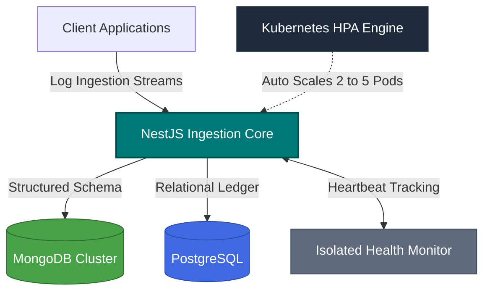
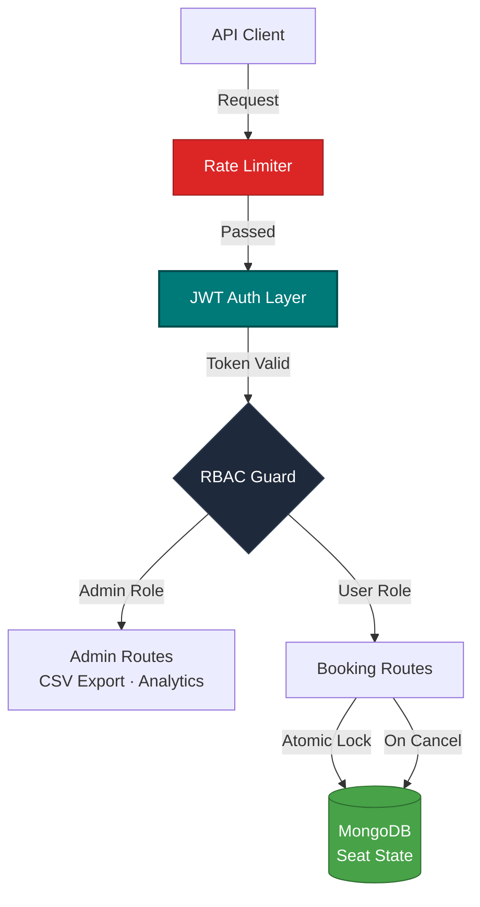
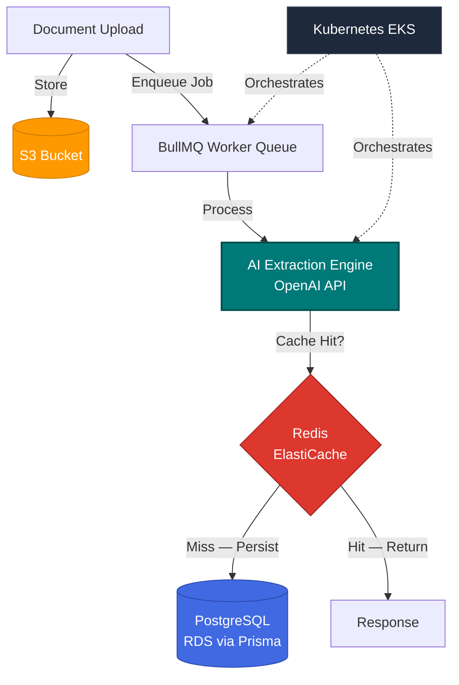

<!-- Decorative banner — no text inside so fallback never breaks the name -->

<!-- Name always renders as HTML — never dependent on capsule-render -->
<h1>
  
</h1>

<h3>⚙️ Backend & Platform Engineer</h3>

  <em>Building systems that hold up under pressure — 
  distributed infrastructure · async pipelines · cloud-native backends</em>

 

---

## 👤 About Me

Backend engineer with a platform mindset. I work primarily in **Node.js / TypeScript**, and I think about systems the way an operator would — not just *"does it work"* but *"will it hold up at 3am when load spikes and someone's paging you."*

- 🏗️ **Core Systems** — Scalable backend services, event-driven distributed architectures, cloud-native infrastructure
- 🔭 **Observability** — Structured logging, custom metric collectors, distributed tracing, health monitoring
- 🌱 **Currently** — Building an AI document processing pipeline with BullMQ workers, Redis caching, and K8s on AWS

📍 **Ahmedabad, India** &nbsp;·&nbsp; 🌎 Open to Backend, Platform, and Cloud Engineering roles &nbsp;·&nbsp; 💼 Remote-friendly

---

## 📐 Engineering Principles

> [!IMPORTANT]
> System design decisions prioritize architectural integrity, reliable failure modes, and automated reproducibility over manual operations.

| Principle | Practice |
|-----------|----------|
| 🏛️ **Architecture First** | Explicit loose coupling between layers; core services stay independent |
| 🛡️ **Reliability Matters** | Systems expect, isolate, and recover from runtime faults gracefully |
| 🔍 **Observability by Default** | First-class tracing, telemetry metrics, and structured logging from day one |
| 🤖 **Automation Over Manual** | CI/CD pipelines and declarative IaC eliminate operational overhead |
| 📄 **Document as You Build** | Swagger specs, `.env.example`, and architecture diagrams ship with the code |

---

## ⚡ Tech Stack

**Backend & Runtime**

**Databases & Caching**

**Infrastructure & Cloud**

**Tooling & Observability**

---

## 📂 Featured Projects & Production Architecture

> [!NOTE]
> Each system below was engineered around asynchronous scaling, distributed state, and high availability — not just functional correctness.

---

### 🔦 1. [Beacon](https://github.com/AjayMaruda/beacon) — Centralized Log Ingestion Platform

*A self-hosted observability platform engineered to collect, store, and verify system health logs across distinct microservices.*

| Feature | Detail |
|---------|--------|
| ⚖️ **Elastic Scaling** | Kubernetes HPA scales ingestion pods 2 → 5 dynamically under load |
| 🗄️ **Storage Isolation** | Dual-database: hot telemetry to MongoDB · relational ledger to PostgreSQL |
| 💓 **Service Integrity** | Dedicated health monitor verifies ingestion pipeline availability continuously |

---

### 📅 2. [Event Booking System](https://github.com/AjayMaruda/event-booking-system) — Production-grade Booking API

*A full-featured backend API built around secure access control, atomic state transitions, and production-conscious reliability.*

| Feature | Detail |
|---------|--------|
| 🔐 **Access Control** | JWT auth + RBAC (Admin / User) enforced at the middleware layer |
| ⚛️ **Atomic Transactions** | Seat booking and cancellation are fully atomic — inventory always consistent |
| 🚧 **Abuse Prevention** | Rate limiting on auth routes prevents brute-force and credential-stuffing |

---

### 🤖 3. [AI Doc Intelligence Platform](https://github.com/AjayMaruda/ai-doc-intelligence-platform) — Async AI Processing Pipeline *(active)*

*A cloud-native document processing system designed for high-throughput async extraction, distributed caching, and full AWS deployment.*

| Feature | Detail |
|---------|--------|
| 🔄 **Async Workers** | BullMQ decouples ingestion from processing — each stage scales independently |
| ⚡ **Distributed Cache** | Redis reduces redundant AI API calls and cuts repeat-document latency |
| ☁️ **Cloud-Native** | Fully containerized on AWS EKS with RDS, S3, and ElastiCache |

---

## 📊 GitHub Activity

> 💡 Most active development occurs in private repositories and client engagements. Public repositories represent production architecture patterns — engineered for real-world constraints, not toy examples.

---

 

