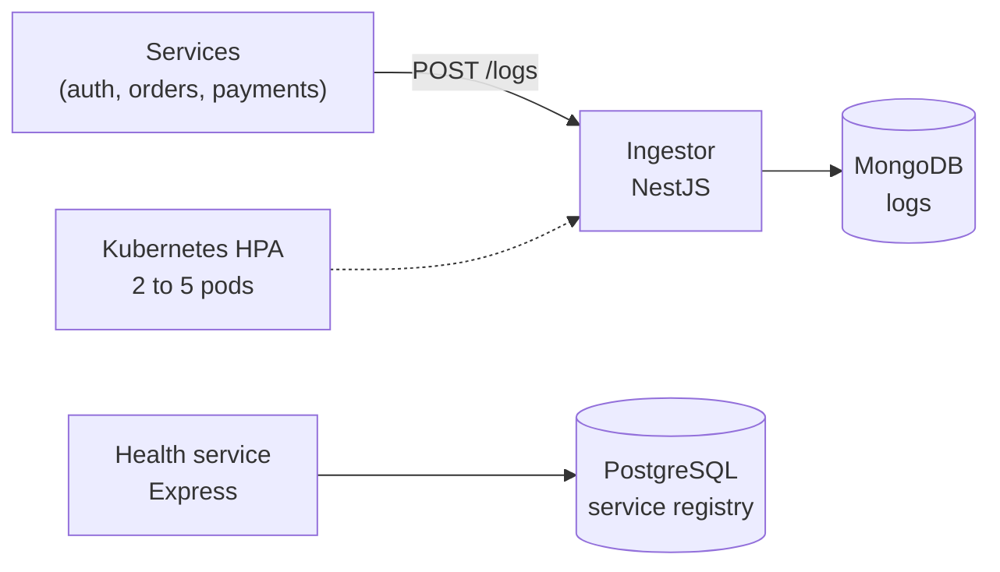
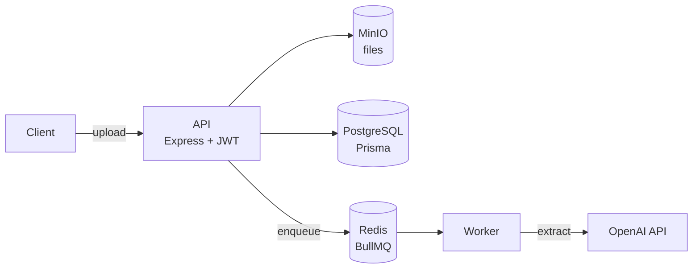
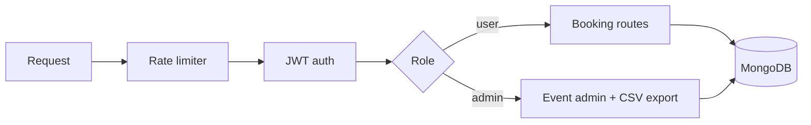

# Ajay Maruda

### Backend Software Engineer

Building APIs, data models and background-processing pipelines in **Node.js** and **TypeScript**

 

[LinkedIn](https://linkedin.com/in/ajay-maruda) &nbsp;·&nbsp; Ahmedabad, India &nbsp;·&nbsp; Open to Backend / Software Engineer roles

 

## About

I build REST APIs and backend services with NestJS and Express, with a focus on authentication, data modeling across PostgreSQL and MongoDB, and background processing with job queues. I started in data and reporting (Power BI dashboards) before moving into backend development.

Most of my professional work lives in private repositories, so the projects below are my public examples.

|  |  |
|---|---|
| **Experience** | About a year building and maintaining backend services |
| **Focus** | REST APIs, JWT/RBAC auth, SQL and document databases, queue-based workers |
| **Also built** | Docker and Kubernetes manifests, and a Vue 3 client for my own API |
| **Now building** | A document-processing pipeline with a job queue and an LLM API |
| **Now learning** | Python for ML, LLM applications, AWS deployment, CI/CD |

 

## Featured Projects

### Beacon: centralized log ingestion for microservices

A lightweight, self-hosted way to collect logs from several services in one place and query them by service name and log level.

```mermaid
flowchart LR
    S["Services<br>(auth, orders, payments)"] -->|POST /logs| I["Ingestor<br>NestJS"]
    I --> M[("MongoDB<br>logs")]
    H["Health service<br>Express"] --> P[("PostgreSQL<br>service registry")]
    K["Kubernetes HPA<br>2 to 5 pods"] -.-> I
```

- NestJS ingestor stores logs in MongoDB; a separate Express service keeps a service registry in PostgreSQL and exposes a health endpoint
- Multi-stage Dockerfiles and Swagger docs for both services; the whole stack runs with `docker compose up`
- Kubernetes manifests (ConfigMap, Secret, Ingress) with an HPA that scales the ingestor from 2 to 5 pods on CPU load

**[View repository](https://github.com/AjayMaruda/beacon)**

 

### AI Document Intelligence Platform &nbsp;`in progress`

A backend for uploading documents and extracting structured data from PDFs with an LLM.

```mermaid
flowchart LR
    C["Client"] -->|upload| A["API<br>Express + JWT"]
    A --> O[("MinIO<br>files")]
    A --> D[("PostgreSQL<br>Prisma")]
    A -->|enqueue| Q[("Redis<br>BullMQ")]
    Q --> W["Worker"]
    W -->|extract| L["OpenAI API"]
```

- Extraction runs in a separate BullMQ worker process, so uploads never block on AI calls
- JWT-protected API with Zod validation, Helmet and structured logging with Pino
- Status: core pipeline under active development; architecture and setup docs are being written

**[View repository](https://github.com/AjayMaruda/ai-doc-intelligence-platform)**

 

### Event Booking System: REST API + Vue client

A booking backend with role-based access, seat tracking and an admin export.

```mermaid
flowchart LR
    R["Request"] --> L["Rate limiter"] --> J["JWT auth"] --> G{"Role"}
    G -->|user| B["Booking routes"]
    G -->|admin| E["Event admin + CSV export"]
    B --> DB[("MongoDB")]
    E --> DB
```

- JWT authentication with admin/user roles enforced in middleware; passwords hashed with bcrypt
- Seat availability updates on booking and is restored on cancellation
- Rate limiting on auth and booking routes, input validation, event filtering and pagination, Swagger docs
- Vue 3 client with Pinia, Vue Router and Tailwind, including a role-based UI

**[Backend repository](https://github.com/AjayMaruda/event-booking-system)** &nbsp;·&nbsp; **[Frontend repository](https://github.com/AjayMaruda/event-booking-frontend)**

 

## Tech Stack

| | |
|---|---|
| **Languages** | TypeScript, JavaScript, SQL |
| **Backend** | Node.js, NestJS, Express, REST, Swagger/OpenAPI |
| **Auth and validation** | JWT, bcrypt, Zod, express-validator, rate limiting |
| **Databases** | PostgreSQL (Prisma, Sequelize), MongoDB (Mongoose), Redis |
| **Queues** | BullMQ |
| **Containers** | Docker, Docker Compose, Kubernetes manifests with HPA (local, Minikube) |
| **Tooling** | Git, ESLint, Prettier, Husky |
| **Frontend (secondary)** | Vue 3, Pinia, Vue Router, Tailwind CSS | Reactjs | Nextjs |
| **Data and reporting** | Power BI |

**Currently learning**

 

## Engineering Interests

- Backend architecture and API design
- Background processing and queue-based workflows
- Database design across SQL and document stores
- Containerized deployments and Kubernetes basics
- AI-powered applications built on solid backend foundations

 

**[LinkedIn](https://linkedin.com/in/ajay-maruda)**

